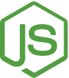

# Blockchain de Energia Renovável

Sistema de blockchain para gestão de energia renovável desenvolvido com Laravel.

## Tecnologias Usadas

<div align="center">
  <table>
    <tr>
      <td align="center">
        <br/>
        <strong>Laravel</strong>
      </td>
      <td align="center">
        <br/>
        <strong>PHP</strong>
      </td>
      <td align="center">
        <br/>
        <strong>Composer</strong>
      </td>
      <td align="center">
        <br/>
        <strong>Node.js</strong>
      </td>
    </tr>
    <tr>
      <td align="center">
        <br/>
        <strong>Vite</strong>
      </td>
      <td align="center">
        <br/>
        <strong>Tailwind CSS</strong>
      </td>
      <td align="center">
        <br/>
        <strong>PHPUnit</strong>
      </td>
      <td align="center">
        <br/>
        <strong>Blockchain</strong>
      </td>
    </tr>
  </table>
</div>

## Sobre os Logos das Tecnologias

Os arquivos de logo SVG estão localizados em `Imagens/tech/`. Os nomes dos arquivos são **sensíveis a maiúsculas/minúsculas** (case-sensitive).

### Arquivos Incluídos:
- `Imagens/tech/laravel.svg` - Logo do Laravel Framework
- `Imagens/tech/php.svg` - Logo do PHP
- `Imagens/tech/composer.svg` - Logo do Composer (gerenciador de dependências PHP)
- `Imagens/tech/nodejs.svg` - Logo do Node.js
- `Imagens/tech/vite.svg` - Logo do Vite (bundler frontend)
- `Imagens/tech/tailwind.svg` - Logo do Tailwind CSS
- `Imagens/tech/phpunit.svg` - Logo do PHPUnit (framework de testes)
- `Imagens/tech/blockchain.svg` - Ícone representativo de Blockchain

### Fontes Sugeridas para Atualização dos Logos:
- **Laravel**: [Wikimedia Commons - Laravel.svg](https://commons.wikimedia.org/wiki/File:Laravel.svg)
- **PHP**: [PHP.net Logos](https://www.php.net/images/logos/php-logo.svg)
- **Composer**: [Seeklogo - Composer](https://seeklogo.com/vector-logo/272997/composer) ou Wikimedia
- **Node.js**: [Wikimedia Commons - Node.js_logo.svg](https://commons.wikimedia.org/wiki/File:Node.js_logo.svg)
- **Vite**: [Vite GitHub Repository](https://raw.githubusercontent.com/vitejs/vite/main/docs/public/logo.svg)
- **Tailwind CSS**: [Wikimedia Commons - Tailwind_CSS_Logo.svg](https://commons.wikimedia.org/wiki/File:Tailwind_CSS_Logo.svg)
- **PHPUnit**: [Wikimedia Commons - PHPUnit_Logo.svg](https://commons.wikimedia.org/wiki/File:PHPUnit_Logo.svg)
- **Blockchain**: [SVG Repo - Blockchain Icon](https://www.svgrepo.com/svg/227881/blockchain)

### Instruções para Atualizar/Substituir Logos:
1. Baixe o arquivo SVG da fonte oficial ou confiável
2. Renomeie o arquivo para corresponder exatamente ao nome esperado (ex: `laravel.svg`)
3. Coloque o arquivo na pasta `Imagens/tech/`
4. Verifique se o logo aparece corretamente no README

## Instalação

```bash
# Clone o repositório
git clone https://github.com/Otaviocuriel/Blockain_De_Energia_Renovavel.git

# Instale as dependências PHP
composer install

# Instale as dependências Node.js
npm install

# Configure o ambiente
cp .env.example .env
php artisan key:generate

# Execute as migrações
php artisan migrate

# Compile os assets
npm run build
```

## Desenvolvimento

```bash
# Inicie o servidor de desenvolvimento
php artisan serve

# Em outro terminal, inicie o Vite
npm run dev
```

## Testes

```bash
# Execute os testes PHPUnit
php artisan test
```

## Licença

Este projeto está sob licença MIT.
